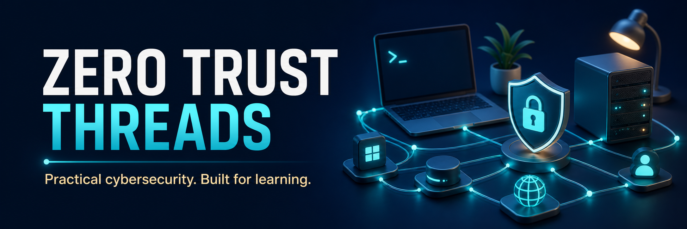

Welcome to the **Zero Trust Threads GitHub Learning Ecosystem**.

This organization is dedicated to making cybersecurity more approachable through free, hands-on, beginner-friendly projects.

No hype. No promises of overnight cybersecurity careers.

Just practical projects designed to help you learn by doing.

---

## 🎯 Our Mission

Cybersecurity can be overwhelming when you are trying to figure out where to start.

Zero Trust Threads exists to make that starting point a little easier.

The projects here are designed to help you:

- Learn cybersecurity fundamentals
- Build practical technical skills
- Create your own home lab
- Understand Linux and networking
- Explore defensive security
- Learn security, risk, and GRC concepts
- Build projects you can expand on yourself

The goal isn't to make things unnecessarily complicated.

**One concept. One project. Learn by doing.**

---

## 🚀 Start Here

New to cybersecurity?

You don't need to know everything before you begin.

A future recommended learning path will look something like this:

```text
Cybersecurity Fundamentals
          ↓
       Linux
          ↓
     Networking
          ↓
      Home Lab
          ↓
   Security Tools
          ↓
    Blue Team Labs
          ↓
   Security Projects
```

More beginner learning resources are coming as the ecosystem grows.

---

## 🧰 Projects

### 🛡️ Security Headers Checker

**Repository:** `ztt-security-headers`

Learn how HTTP security headers help protect websites and browsers.

**You'll explore:**

- HTTP security headers
- Browser security concepts
- Common web security misconfigurations
- Defensive security
- Python CLI tooling
- Security reporting

**Status:** Available

---

### 🖥️ Cybersecurity Home Lab

**Repository:** [`ztt-home-lab`](https://github.com/ZeroTrustThreads/ztt-home-lab)

Build a beginner-friendly cybersecurity lab using virtual machines, Linux, networking, and containers.

**You'll explore:**

- Virtual machines on macOS, Windows, and Linux
- Ubuntu Server
- Linux fundamentals
- Networking and SSH
- Docker
- Safe lab environments

**Current milestone:** Ubuntu Server VM foundation with SSH access

**Status:** In Development

---

### 🐧 Linux Learning Labs

**Repository:** `ztt-linux-labs`

Hands-on exercises for learning the Linux skills commonly encountered in cybersecurity and IT.

**Topics will include:**

- Files and directories
- Users and groups
- Permissions
- Processes
- Services
- SSH
- Logs
- Basic system hardening

**Status:** Planned

---

### 🌐 Networking Labs

**Repository:** `ztt-networking-labs`

Learn the networking concepts that make security concepts easier to understand.

**Topics will include:**

- IP addresses
- Ports
- TCP and UDP
- DNS
- Firewalls
- Packet analysis
- Network troubleshooting

**Status:** Planned

---

## 🧪 Learn → Build → Understand

ZTT projects follow a simple philosophy.

### 1. Learn

Understand what the technology or security concept does.

### 2. Build

Use it yourself through a practical project or lab.

### 3. Understand

Don't just run commands.

Learn **why something happened, what the security implications are, and how you would investigate or improve it.**

---

## 🗺️ What's Coming

The Zero Trust Threads learning ecosystem will continue expanding with projects covering:

- 🔐 Password security
- 📊 Log analysis
- 🔎 File integrity monitoring
- 🐳 Docker security
- 🛡️ Blue team fundamentals
- 📋 GRC and risk management
- 📄 Security policies
- ☁️ Cloud security
- 🧰 Cybersecurity cheat sheets
- 💼 Interview preparation
- 🏠 Home lab projects
- 🗺️ Cybersecurity learning roadmaps

Projects will be released as they are ready rather than creating empty repositories.

---

## 🌱 Beginner Friendly

These repositories are intentionally designed for people who are still learning.

When possible, projects will include:

- Clear explanations
- Copy-and-paste setup commands
- Example output
- Hands-on exercises
- Challenges
- Troubleshooting guidance
- Security explanations
- Additional learning resources

You are encouraged to experiment, break things in your own lab, fix them, and learn how they work.

---

## ⚠️ Responsible Use

Projects and materials provided by Zero Trust Threads are intended for educational and defensive security purposes.

Only test systems, applications, networks, or environments that you own or have explicit authorization to test.

You are responsible for using these materials legally and responsibly.

---

## 🤝 Contributing

Zero Trust Threads is building these projects as learning resources for the cybersecurity community.

Bug reports, documentation improvements, educational suggestions, and project ideas are welcome.

Contribution guidelines will be available as the community grows.

---

## 🧵 Zero Trust Threads

**Trust Nothing. Wear Everything.**

Cybersecurity • Linux • GRC • Defensive Security • Security Culture

---

## ⭐ Learn Something Useful?

Consider starring the project that helped you.

It helps other learners discover the resources too.
